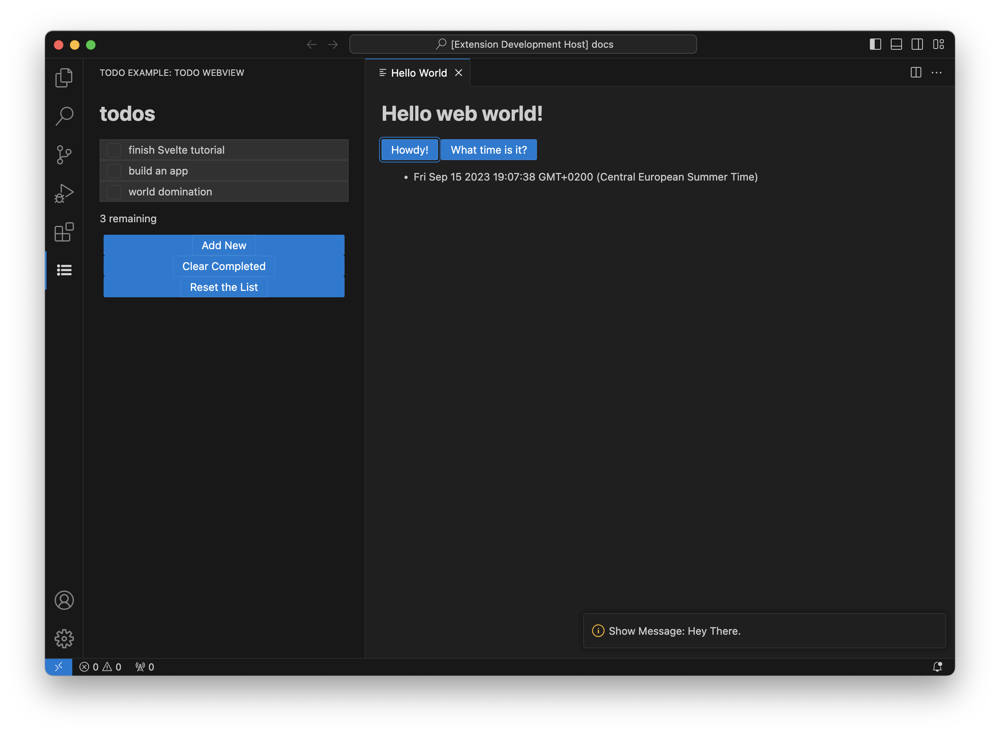

# Hello World (Svelte)

This is a spin off of [Hello World Svelte](https://github.com/microsoft/vscode-webview-ui-toolkit-samples/tree/main/frameworks/hello-world-svelte)
with a bit of Todo thrown in for demonstration.

It fixes a few issues:

- Updates all the dependencies (as of September 2023)
- Fixes the Content Security Policy so that the script and styles are properly loaded.



## New Features

- JSON-RPC communication between the client (webview) and the server (extension).

## Documentation

For a deeper dive into how this sample works, read the guides below.

- [Extension structure](./docs/extension-structure.md)
- [Extension commands](./docs/extension-commands.md)
- [Extension development cycle](./docs/extension-development-cycle.md)

## Run The Sample

```bash
# Copy sample extension locally
npx degit Jason3S/webview-sample-svelte-hello-world hello-world

# Navigate into sample directory
cd hello-world

# Install dependencies for both the extension and webview UI source code
npm run install:all

# Build webview UI source code
npm run build:all

# Open sample in VS Code
code .
```

Once the sample is open inside VS Code you can run the extension by doing the following:

1. Press `F5` to open a new Extension Development Host window
2. Inside the host window, open the command palette (`Ctrl+Shift+P` or `Cmd+Shift+P` on Mac) and type `Hello World (Svelte): Show`
